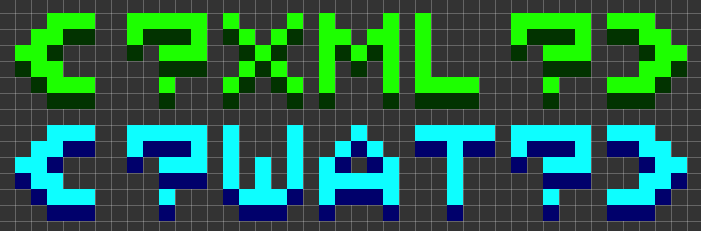

# create-xml-ls [](http://travis-ci.org/yamadapc/create-xml-ls)


Another JS object to XML converter

## Instalation

```npm install create-xml-ls```

## Example

### Javascript

#### createXml(obj[, options])

```javascript
var createXml = require('create-xml-ls');

createXml({
  something: {
    is: 'very',
    ugly: {
      $attr: {
        IMHO: 'it sucks'
      }
      but: 'sometimes we have to live with it'
    }
  }
}, { pretty: true });
/* =>
<?xml version="1.0" encoding="UTF-8"?>
<something>
  <is>very</is>
  <ugly IMHO="it sucks">
    <but>sometimes we have to live with it</but>
  </ugly>
</something>
*/
```
Indentation is off by default, but can be toggled with ```options.pretty``` set
to true.

The default attributes key is ```'$attr'```, but you can also use a custom one
by setting ```options.attributesKey``` to the desired key.
```javascript
createXml({
  something:
    is: {
      attributes: {
        'kind': 'of'
      },
      interesting: 'about this'
    }
}, { pretty: true, attributesKey: 'attributes' );
/* =>
<?xml version="1.0" encoding="UTF-8"?>
<something>
  <is kind="of">
    <interesting>about this</interesting>
  </is>
</something>
*/
```

There's also support for array properties.
```javascript
createXml({
  arrayExample: {
    sometimes: [
      'I',
      'had',
      'to',
      'do',
      'this'
    ]
  }
}, { pretty: true });
/* =>
<?xml version="1.0" encoding="UTF-8"?>
<arrayExample>
  <sometimes>I</sometimes>
  <sometimes>had</sometimes>
  <sometimes>to</sometimes>
  <sometimes>do</sometimes>
  <sometimes>this</sometimes>
</arrayExample>
*/}
```

## License
Copyright (c) 2013 Pedro Yamada. Licensed under the MIT license.
